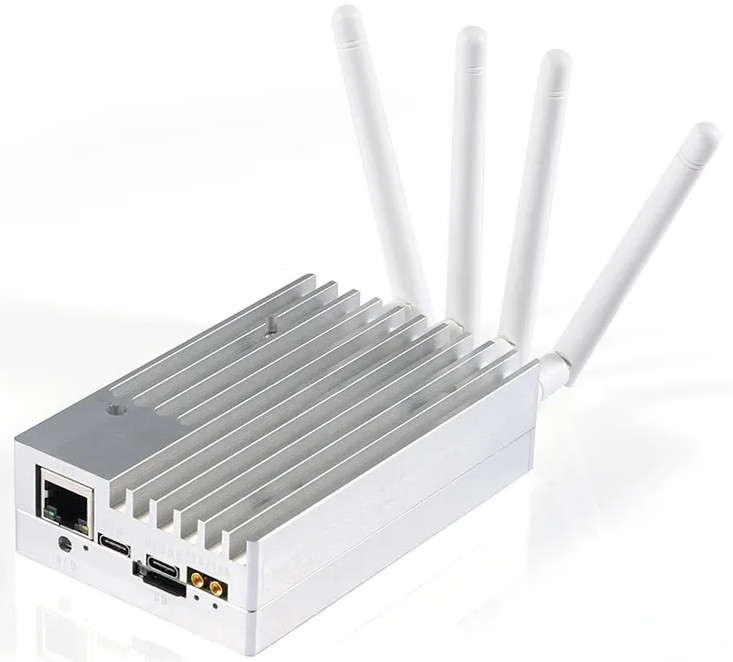
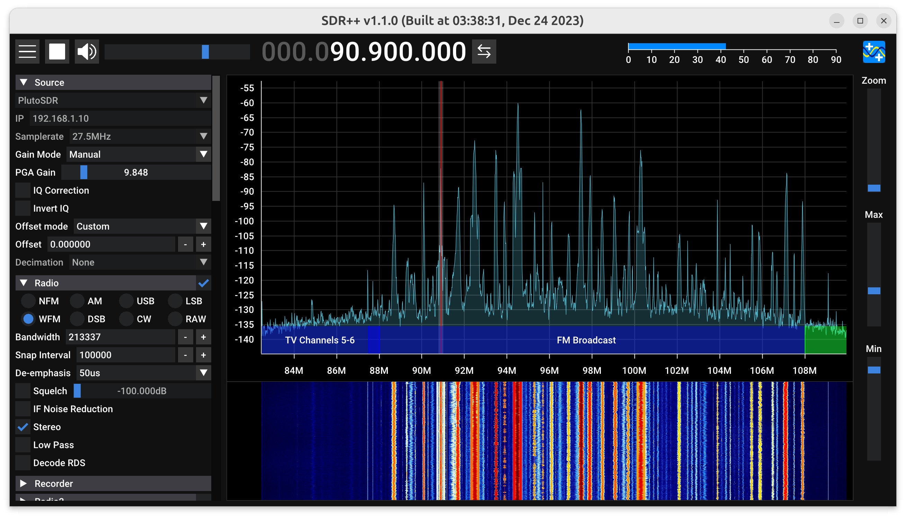

# LibreSDR with Zynq SoC overclock and Optimized Sample Rates

This is an unofficial port of PlutoSDR onto LibreSDR a.k.a. ZynqSDR.
The repo is based on [day0wl](https://github.com/day0wl)'s [repo](https://github.com/day0wl/libresdr-fw.git)
with several enhancements:

* Optimized linux kernel and buildroot to support higher practical sampling rates with libiio/PlutoSDR API (20 MSPS without overlock, compared to ~10 MSPS stock)
* Xinlinx Zynq SoC overclock support (27.5 MSPS achieved with overclock to 1100 MHz CPU + 750 MHz DDR)
* Use LVDS mode for AD9361 to support max sampling rates in 2T2R mode
* Based on PlutoSDR v0.38 firmware (Nov 17, 2023)
* Prebuilt firmware with different overclocking options

There is not a whole lot of information from the manufacturer, but the device
can be purchased on Aliexpress, eBay and other platforms. The hardware includes
**Zynq 7020** Soc with **1GB** DDR3 memory. It is better than a few other
similarly priced Pluto-based SDRs (like PlutoPlus) due to the larger FPGA and
memory.



The board schematics from one of the Aliexpress sellers is included, see
[zynqsdr_rev5.pdf](./zynqsdr_rev5.pdf).  This set of patches was not tested for full functionality
in every possible mode, probably contains bugs or incorrect interpretations of
schematics and intended for fellow hackers to get started with low level
software and FPGA modifications.

## Prebuilt firmware

Checkout the prebuilt firmware under the "Release" section on github.  The base
clock without overclocking is 750MHz for CPU and 525 MHz for memory, and you
should be able to run continous 20MSPS with the libiio/PlutoSDR API over gigabit
Ethernet. Several different overclocked firmware package for the Zynq 7020 SoC
were provided. With 1100 MHz CPU and 750 MHz memory overclock, I can run 27.5
MSPS continous sampling on Ubuntu + SDR++.

## Build

The build requires Vivado and Vitis 2022.2. I installed these packages to build
on Ubuntu:

```sh
sudo apt install libgmp-dev libmpc-dev git build-essential fakeroot libncurses5-dev libssl-dev ccache dfu-util u-boot-tools device-tree-compiler mtools bc python3 cpio zip unzip rsync file wget flex bison language-pack-en libtinfo5 x11-utils xvfb dbus-x11 libswt-glx-gtk-4-jni libgtk2.0-0
```

On Ubuntu 23.10, you need to install `libtinfo5` manually:

```sh
wget http://security.ubuntu.com/ubuntu/pool/universe/n/ncurses/libtinfo5_6.4-2ubuntu0.1_amd64.deb
sudo dpkg -i libtinfo5_6.4-2ubuntu0.1_amd64.deb
```

Then build the firware, run these commands in cloned repo:

```sh
# Clone original v0.38 firware for PlutoSDR
git clone --branch v0.38 --recursive https://github.com/analogdevicesinc/plutosdr-fw.git plutosdr-fw_0.38_libre
# Apply patch for LibreSDR
./apply.sh
cd plutosdr-fw_0.38_libre
# Change Vivado path if you installed it to a different folder.
export VIVADO_SETTINGS=/opt/Xilinx/Vivado/2022.2/settings64.sh
export TARGET=libre
make
make sdimg
```

Collect results in build directory and in addition a set of files for the sd
card in `build_sdimg` folder. Copy the files inside the `build_sdimg` into a
empty SD Card formated as FAT32 and boot the SDR with the SD card.

## Performance improvements and overclock

The firmware shipped with these devices supports about 11 to 12 MSPS continuous
sampling.  The original design runs the CPU at 675 MHz and DDR at 525 MHz.  In
this repo, the default CPU clock has been increased to 750 MHz (still within
the spec of the chip, where the maximum is 766 MHz).  Combined with other
optimizations I've done in this codebase, you can expect around 20 MSPS
continuous sampling rate without overclocking.

After the firmware has been successfully built, you can try the overclock
script by setting up the CPU clock and DDR clock multipliers manually.  All
clocks are multiples of 25 MHz. For example, to run CPU at 1100 MHz and DDR at
625 MHz, you can run:

```sh
export VIVADO_SETTINGS=/opt/Xilinx/Vivado/2022.2/settings64.sh
export TARGET=libre
OVERCLOCK_CPU_MULT=44 OVERCLOCK_DDR_MULT=25 make overclock
rm -r build_sdimg
make sdimg
```

You can run the memory at a much higher clock by increasing the timing
parameters.  They are defined in `hdl/projects/libre/system_bd.tcl` (looking
for `PCW_UIPARAM_DDR_CL` and a few others). With a 9-7-9-9 timing I can
overclock mine to 750 MHz.

With the overclock (1100 MHz CPU + 750 MHz DDR), I can achieve about 27.5 MSPS
continous sampling on Ubuntu and SDR++, and above that the limitation is
actually my host computer (Ethernet running at ~900Mbps and the CPU needs to
process everything very fast). You need to enlarge the libiio block size in
your SDR application to achieve high sampling rates. I use SDR++ and the
default sampling block size is too small.  You can change it
[here](https://github.com/AlexandreRouma/SDRPlusPlus/blob/b1030cbdfb8b83486beecd0e1085a25fe74f3d85/source_modules/plutosdr_source/src/main.cpp#L236).
I changed it to 1000000 and recompiled SDR++. Enlarging the block buffer is
necessary for sampling rates above 20 MSPS. Also you need to remove the
sampling rate limit in your SDR software (SDR++ has a limit of 20 MSPS for
PlutoSDR and can be easily changed
[here](https://github.com/AlexandreRouma/SDRPlusPlus/blob/b1030cbdfb8b83486beecd0e1085a25fe74f3d85/source_modules/plutosdr_source/src/main.cpp#L46)).
A dedicated NIC for connecting to the SDR is recommended.

Further improvements can be made by packing the 12-bit IQ samples into three
bytes and do not transfer leading zeros (currently 4 bytes are used for each IQ
sample). But that may require changes in HDL, libiio server and clients, and it
is difficult to make it compatible with existing software that supports
PlutoSDR.



## Other information

Usually LibreSDR is shipped with empty qspi flash and boots from included SD
card.  Use any small capacity sd card, format it as FAT32 and copy content of
the `build_sdimg` directory on it. Insert the sdcard into LibreSDR and it
should boot from it.  Once it is running, the software can be updated using
mounted drive, just like PlutoSDR.  This will populate QSPI flash and LibreSDR
will be able to run without SD Card USB OTG will act as normal PlutoSDR.
Serial console is available on the debug port as `/dev/ttyUSB2` if you don’t
have any other USB serial devices in the system. Set your terminal application
to 115200N8 Gigabit Ethernet is enabled, IP address is set by default to
192.168.1.10

You can also use a full AD provided linux build, just replace BOOT.BIN and
device tree file from this build and it should be able to mount the SD card as
the root file system, This will aloow you to run any Linux applications or
scripts directly on LibreSDR

From this point you are on your own, but pull requests and enhancements are
welcome!

